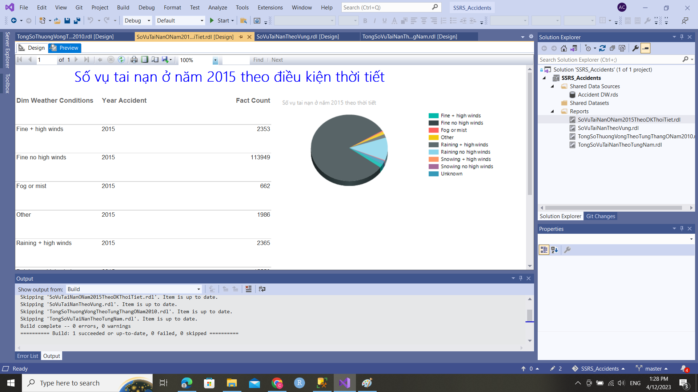
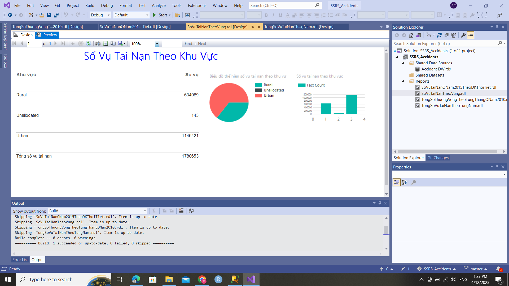

## Using SQL Server Reporting Services and Power BI to create reports and analyze data on traffic   accidents in the UK from 2005 to 2015.

- Data : AccidentInUK in Analysis Service
    <a href="https://github.com/vanac17122001/Accident_In_UK_SSAS">Link to SSAS project</a>

- Some reports:
    + By SSRS: 
        1. Traffic Accidents in 2010 Classified by Weather Conditions.
        
        2. Traffic Accidents Classified by region.
        
    + By Power BI:
        1. The number of casualties by weather conditions in 2015.
        
        2. Traffic Accidents Classified by year
        
- Reference: https://www.youtube.com/watch?v=irm___pxX8I&t=313s&ab_channel=SoanTr%E1%BA%A7n Report PowerBI, Soan Tran
